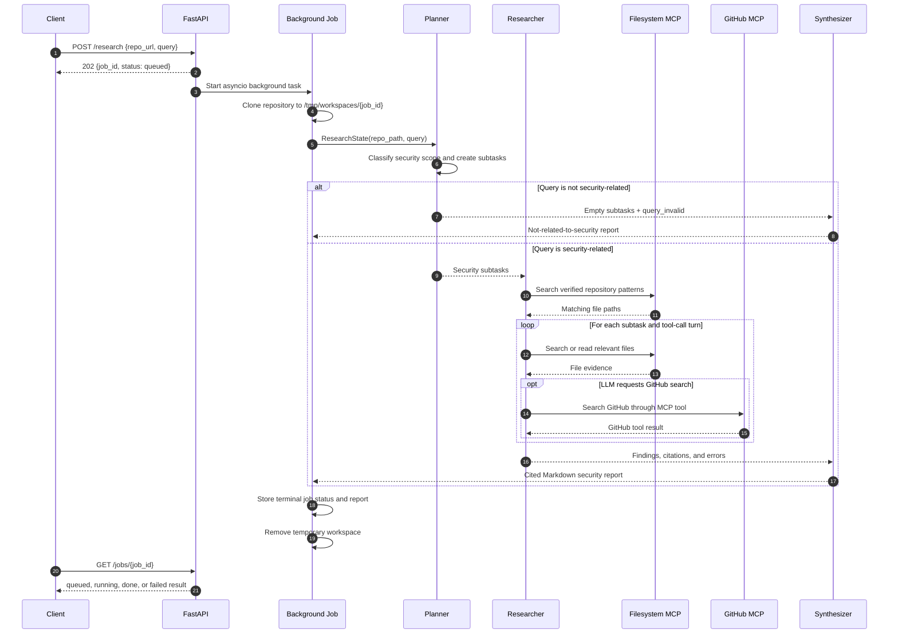

# Clone & Scan Codebase Analysis

Clone & Scan is an internal technical due diligence and code security analysis service. It accepts a remote HTTP(S) repository URL and a security-focused research question, clones the repository into an isolated temporary workspace, and runs a LangGraph workflow that produces a structured Markdown report grounded in source files and line ranges.

The service is intentionally security-focused. It supports questions about authentication, authorization, access control, secrets, sessions, cryptography, injection, unsafe input handling, dependency security, and related risks. The planner rejects general architecture, feature, performance, or unrelated questions with a response explaining that the request is not related to code security.

## Contents

- [System Overview](#system-overview)
- [System Architecture and Flow](#system-architecture-and-flow)
- [MCP Integration](#mcp-integration)
- [Getting Started](#getting-started)
- [Running the Service](#running-the-service)
- [API Smoke Tests](#api-smoke-tests)
- [Tracing and Evaluation](#tracing-and-evaluation)
- [Architectural Tradeoffs and Design Decisions](#architectural-tradeoffs-and-design-decisions)
- [Repository Layout](#repository-layout)

## System Overview

The request lifecycle is:

1. FastAPI validates the repository URL and query, creates a job, and returns a job ID with HTTP 202.
2. A background task clones the repository into `WORKSPACE_ROOT/<job_id>`; the default is `/tmp/workspaces/<job_id>`.
3. The LangGraph planner classifies the query as security-related and decomposes an accepted query into structured subtasks.
4. The researcher gathers verified repository evidence with Filesystem MCP search and read tools. It processes the planned subtasks and records findings, citations, and tool errors.
5. The synthesizer converts the evidence dossier into a Markdown security report with severity, impact, recommendations, citations, and limitations.
6. The job result is available from `GET /jobs/{job_id}`. The temporary workspace is removed after completion when `WORKSPACE_CLEANUP=true`.

The state passed through the graph is defined by `ResearchState` and contains the repository path, original query, subtasks, accumulated research results, final report, and error status.

## System Architecture and Flow

The graph is implemented in `app/agents/graph.py` with three nodes:

- **Planner**: Uses structured LLM output (`SubTaskList`) to classify the query and create security research tasks. An empty task list routes directly to the synthesizer.
- **Researcher**: Uses an LLM with MCP tools bound. It verifies a repository inventory, then handles each subtask in a bounded tool-calling loop. The current implementation has one researcher node that processes multiple subtasks sequentially; it is not a set of independent parallel agent nodes.
- **Synthesizer**: Produces the final report from the original query and evidence returned by the researcher. It has explicit paths for invalid queries, empty findings, and synthesis failures.



The graph edges are `START -> planner`, conditional `planner -> researcher|synthesizer`, `researcher -> synthesizer`, and `synthesizer -> END`. LangGraph invokes the compiled graph asynchronously through `graph.ainvoke(initial_state)`.

## MCP Integration

The service uses the Model Context Protocol to keep repository inspection tool-driven and bounded by configured roots. MCP server processes communicate with the Python service over standard input/output rather than exposing additional HTTP services.

### Dual-server setup

`MCPClientManager` in `app/tools/mcp_client.py` owns two `ClientSession` instances:

- **Filesystem MCP**: started with `npx -y @modelcontextprotocol/server-filesystem <FILESYSTEM_MCP_ROOT>`. It provides the repository search and file-read operations used for evidence gathering.
- **GitHub MCP**: started with `npx -y @modelcontextprotocol/server-github`. It receives `GITHUB_PERSONAL_ACCESS_TOKEN` through its child-process environment and exposes GitHub search functionality.

Both transports and sessions are registered in a Python `AsyncExitStack`. Startup calls `connect()` during the FastAPI lifespan; shutdown closes the stack and cancels active jobs. If a connection or tool call fails, the manager logs the error and returns an error string so the researcher can record the limitation rather than silently inventing evidence.

The LangChain tools exposed to the researcher are:

- `mcp_search_files(repo_path, pattern)`
- `mcp_read_file(filepath, start_line, end_line)`
- `mcp_github_search(query, max_results)`

The researcher only treats files actually returned and read through MCP as citation evidence. MCP calls are also decorated with LangSmith `@traceable` instrumentation.

## Getting Started

### Prerequisites

- Python 3.11 or newer
- Git
- Node.js, npm, and `npx`
- An OpenAI or Anthropic API key
- A GitHub personal access token for private repository access or GitHub MCP searches; public clone scenarios may work without one

### Local setup

From the repository root:

```bash
python3 -m venv .venv
source .venv/bin/activate
pip install -e .
cp .env.example .env
mkdir -p /tmp/workspaces
```

Configure exactly one LLM provider in `.env`:

```env
LLM_PROVIDER=openai
OPENAI_API_KEY=your-openai-key
OPENAI_MODEL=gpt-4o-mini
```

Or:

```env
LLM_PROVIDER=anthropic
ANTHROPIC_API_KEY=your-anthropic-key
ANTHROPIC_MODEL=claude-haiku-4-5
```

### Environment variables

| Variable | Required | Purpose |
| --- | --- | --- |
| `LLM_PROVIDER` | Yes | `openai` or `anthropic`. |
| `OPENAI_API_KEY` | When using OpenAI | API credential for the configured OpenAI model. |
| `ANTHROPIC_API_KEY` | When using Anthropic | API credential for the configured Anthropic model. |
| `OPENAI_MODEL` | No | OpenAI model; defaults to `gpt-4o-mini`. |
| `ANTHROPIC_MODEL` | No | Anthropic model; defaults to `claude-haiku-4-5`. |
| `GITHUB_PERSONAL_ACCESS_TOKEN` | Conditional | Token passed to GitHub MCP for authenticated GitHub access. |
| `WORKSPACE_ROOT` | No | Clone root; defaults to `/tmp/workspaces`. |
| `FILESYSTEM_MCP_ROOT` | No | Filesystem MCP access root; should match the workspace root. |
| `WORKSPACE_CLEANUP` | No | Remove workspaces after jobs; defaults to `true`. |
| `LANGCHAIN_TRACING_V2` | No | Set to `true` to enable LangSmith tracing. |
| `LANGCHAIN_API_KEY` | No | LangSmith API key. `LANGSMITH_API_KEY` is accepted as a fallback. |
| `LANGCHAIN_PROJECT` | No | LangSmith project; defaults to `codebase-analyzer`. |
| `SERVICE_HOST` | No | Bind host; defaults to `0.0.0.0`. |
| `SERVICE_PORT` | No | Service port; defaults to `8000`. |

Do not commit `.env` or credentials. Use `.env.example` as the safe configuration template.

Before running a research job, verify the MCP dependencies and connections:

```bash
node --version
npm --version
npx --version
python -m app.tools.verify_mcp
```

## Running the Service

Start the local API from the repository root:

```bash
uvicorn app.main:app --reload --host 0.0.0.0 --port 8000
```

The service initializes both MCP connections during FastAPI startup. Check liveness and MCP status:

```bash
curl http://localhost:8000/healthz
```

Expected shape:

```json
{"status":"ok","mcp_connected":true}
```

### Container execution

The Docker image installs Git, Node.js, npm, Python dependencies, and the application:

```bash
docker build -t codebase-analyzer .
docker run --rm -p 8000:8000 --env-file .env codebase-analyzer
```

The container must be able to reach the configured LLM and MCP package registries. Mount or configure a workspace root only if the deployment needs a non-default path.

## API Smoke Tests

Submit a security analysis job. Both `repo_url` and the compatibility field name `repo_path` are accepted:

```bash
curl -X POST http://localhost:8000/research \
  -H "Content-Type: application/json" \
  -d '{"repo_url":"https://github.com/khushi-kumari112/banking-microservices","query":"Analyze authorization and access control vulnerabilities"}'
```

The response is immediate and contains a job ID:

```json
{"job_id":"<job-id>","status":"queued","report":null,"error":null}
```

Poll until the job is `done` or `failed`:

```bash
curl http://localhost:8000/jobs/<job-id>
```

For a non-security query:

```bash
curl -X POST http://localhost:8000/research \
  -H "Content-Type: application/json" \
  -d '{"repo_url":"https://github.com/encode/starlette","query":"Explain the application architecture"}'
```

The planner routes this request around repository research. The final report states that the request is not related to code security.

Available endpoints:

| Method | Endpoint | Purpose |
| --- | --- | --- |
| `GET` | `/healthz` | Liveness and MCP connection status. |
| `POST` | `/research` | Queue an asynchronous research job. |
| `GET` | `/jobs/{job_id}` | Retrieve job status or completed report. |
| `POST` | `/api/v1/research-sync` | Compatibility endpoint retained by the service. |

## Tracing and Evaluation

### LangSmith observability

LangSmith tracing is configured by `app/config.py`, which maps the LangSmith settings to the `LANGCHAIN_*` names consumed by LangChain and LangGraph. Enable it with:

```env
LANGCHAIN_TRACING_V2=true
LANGCHAIN_API_KEY=your-langsmith-key
LANGCHAIN_PROJECT=codebase-analyzer
```

After restarting the service and submitting a job, open the `codebase-analyzer` project in LangSmith. A trace should show the graph execution, planner and synthesizer LLM calls, researcher tool-calling turns, and the `mcp_call_tool` spans. Tracing is best-effort observability and does not replace source grounding or evaluation.

### Golden evaluation

The evaluation assets are:

- `eval/golden_dataset.json`: six deterministic tasks against `https://github.com/behitek/simple-rag` (five security analyses and one non-security-query rejection case).
- `eval/evaluate.py`: submits each task to `POST /research`, polls `GET /jobs/{job_id}`, and checks the report for required sections, content terms, architecture/remediation/scope terms, forbidden claims, and minimum citation counts.

Run the evaluator while the API is running:

```bash
python -m eval.evaluate --base-url http://localhost:8000
```

Verified five-security-task run on 2026-09-09, before the non-security rejection case was added:

| Metric | Result |
| --- | --- |
| Tasks passed | `5/5` |
| Overall pass rate | `100.0%` |
| Required-section checks | `17/17` passed |
| Content-term checks | `5/5` passed |
| Minimum-citation checks | `5/5` passed |
| Forbidden-term checks | All observed forbidden-term checks passed |

The evaluation is a deterministic structural regression check, not proof that every security conclusion is correct. It verifies report shape, required terminology, forbidden claims, and citation presence. Continue to inspect the evidence dossier and LangSmith trace when changing prompts, MCP behavior, or citation handling.

## Architectural Tradeoffs and Design Decisions

### Asynchronous FastAPI job handling

The HTTP handlers are asynchronous and return a job ID before cloning and analysis finish. `asyncio.create_task()` starts background work, while `asyncio.to_thread()` keeps blocking Git clone and workspace deletion operations off the event loop. This improves responsiveness and allows multiple jobs to be queued, at the cost of requiring in-memory job tracking and explicit shutdown cancellation.

### Ephemeral workspace isolation

Each job receives a unique directory below `/tmp/workspaces`. This prevents parallel clones from sharing files and gives Filesystem MCP a bounded root. Cleanup is performed in a `finally` block, which reduces retention of customer source code but means a completed workspace is not available for post-job debugging unless cleanup is disabled deliberately.

### MCP subprocess transport

The Filesystem and GitHub MCP servers run as child processes over stdio. `AsyncExitStack` owns both transport contexts and `ClientSession` objects so startup failures can close already-open resources and application shutdown can close both servers consistently. The tradeoff is operational dependency on `node`, `npm`, and `npx`, plus the need to handle subprocess and tool failures without losing the entire API process.

### Evidence-first report generation

The researcher is instructed to use only paths returned by MCP and the synthesizer is instructed not to invent files, line ranges, or vulnerabilities. This reduces hallucination risk, but absence claims are difficult to cite: not finding an authentication file is not proof that no authentication exists. Reports therefore include search scope and limitations, and the evaluator requires citations to expose regressions in grounding.

### False positives in standalone RAG repositories

The golden tasks include a standalone RAG utility repository. Such a repository may contain API-key configuration, prompts, embeddings, or retrieval code without implementing users, sessions, roles, or enterprise access control. The system must distinguish “feature not applicable or not found in the inspected scope” from a confirmed vulnerability. It should not manufacture findings such as missing JWT validation, CSRF protection, or multi-tenant authorization when the repository has no corresponding web or identity boundary.

## Repository Layout

```text
app/
  main.py                 FastAPI endpoints, lifespan, job execution, cleanup
  ingestion.py            Git clone and temporary workspace management
  job_store.py            In-memory job state and report storage
  config.py               Provider, workspace, and LangSmith configuration
  llm.py                  OpenAI/Anthropic model factory
  agents/
    state.py              ResearchState and structured planner models
    graph.py              LangGraph nodes and conditional routing
    nodes.py              Planner, researcher, and synthesizer behavior
  tools/
    mcp_client.py         MCP subprocess sessions and LangChain tool wrappers
    verify_mcp.py         Standalone MCP connectivity check
eval/
  golden_dataset.json     Golden security-analysis tasks
  evaluate.py             Deterministic HTTP evaluation runner
Dockerfile                Container image definition
Project-instructions.md   Product requirements and architecture notes
```

## Development Checks

Compile the Python modules:

```bash
python -m py_compile app/agents/state.py app/agents/nodes.py app/agents/graph.py
```

Run available tests:

```bash
pytest
```

When changing prompts, MCP schemas, or citation formatting, run the golden evaluator and inspect both the report text and the LangSmith trace.
