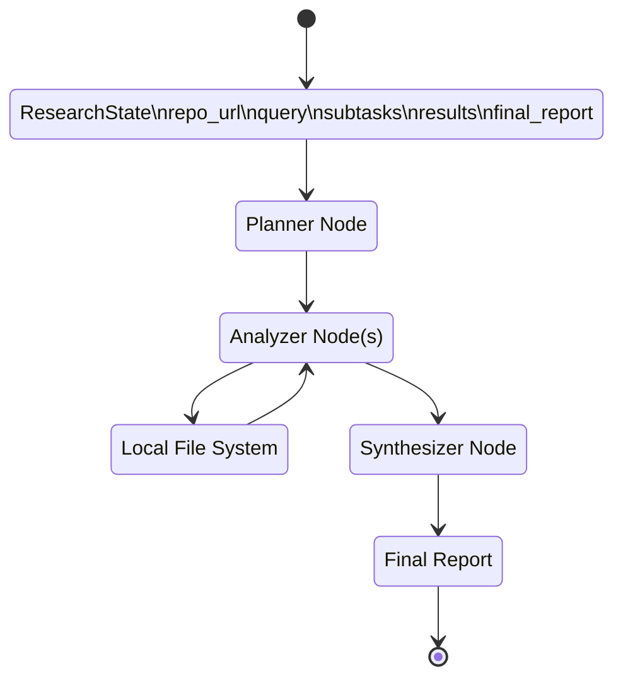

# Codebase Analysis Service

## Problem Statement (Codebase Analysis)

Technical analysts and security auditors at a professional services firm spend significant time on tedious early-stage research: cloning repositories, tracing execution flows, and reading raw code to answer technical questions such as, "Where is authentication handled, and are there exposed endpoints?" This service is intended to automate that work and produce accurate, source-backed codebase analysis reports.

## State Graph Sketch

